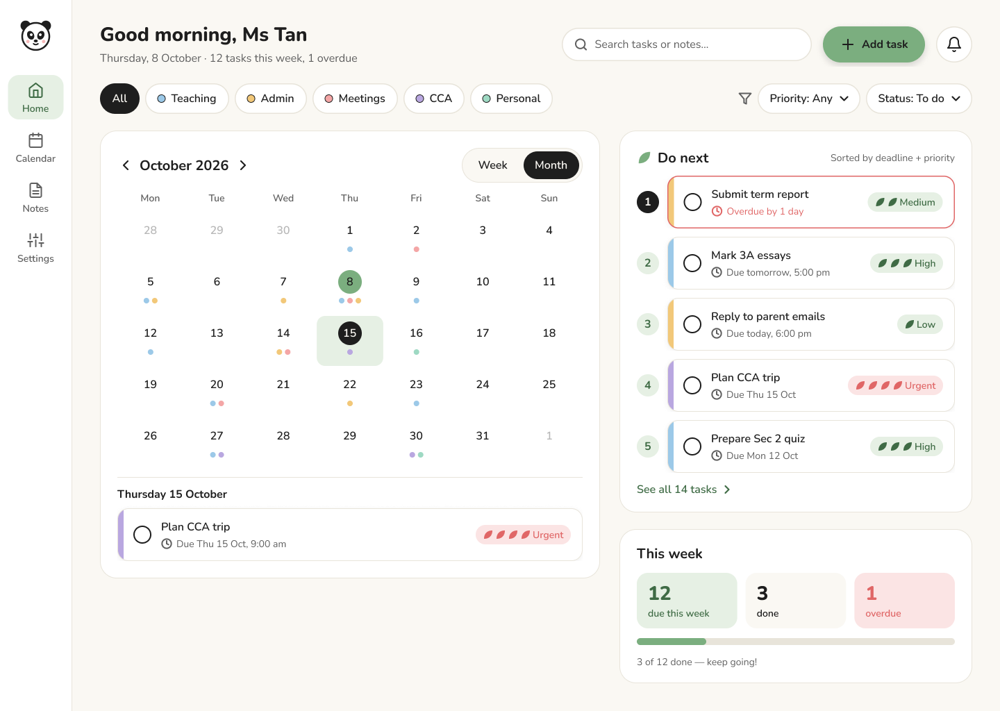
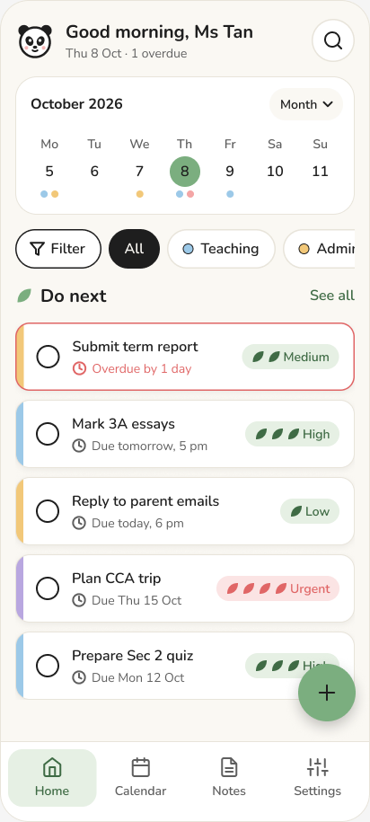
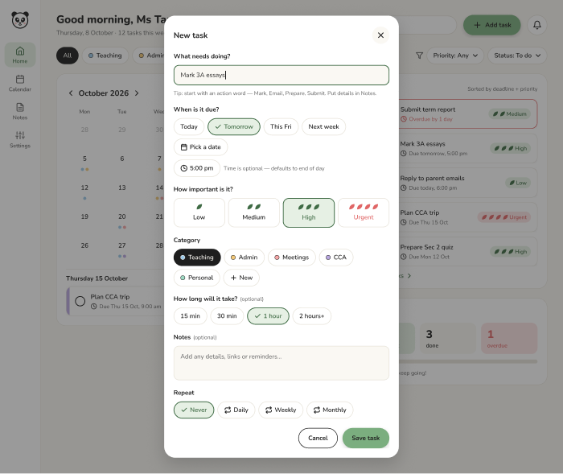
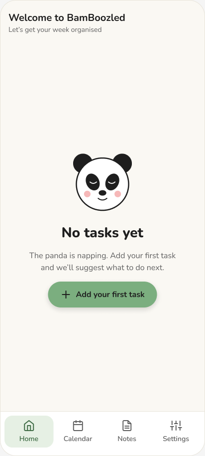
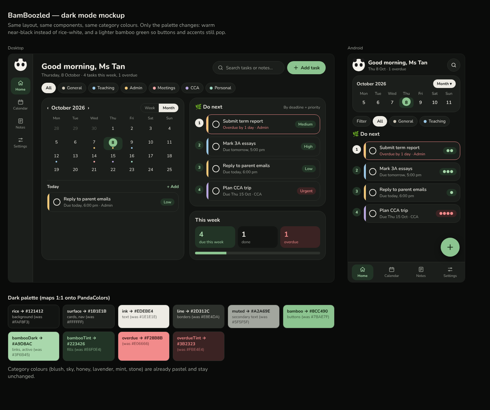
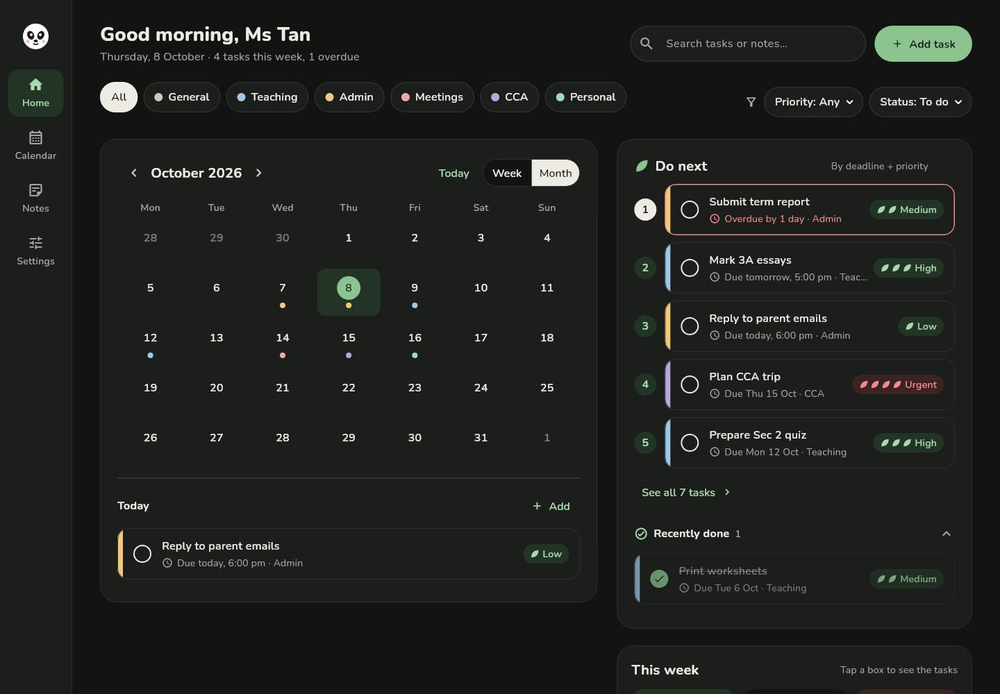
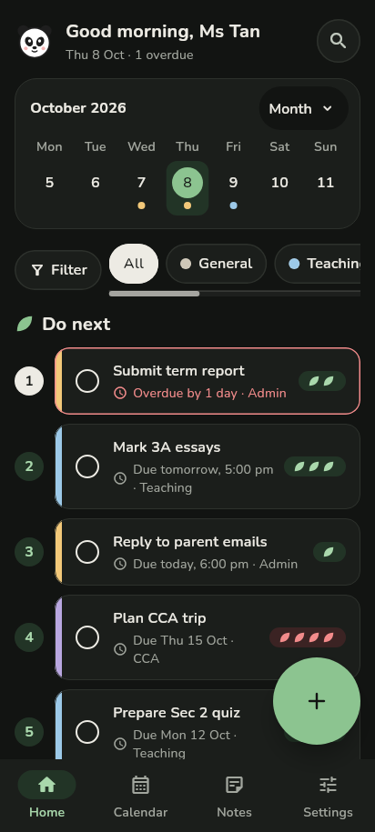

# Welcome page — UI mockup spec

**Figma file:** [BamBoozled — Welcome](https://www.figma.com/design/Qp2xFexfzXZvT2mR8htC4s)

| Page | Contents |
|---|---|
| Styles & Components | Colour variables (`Panda` collection), Nunito text styles, icons, `PandaMascot`, `PriorityBadge`, `CategoryChip`, `Button`, `SearchField`, `TaskCard`, `DayCell`, `WeekDay` |
| Welcome — Screens | Desktop welcome (1440), Android welcome (412×915), Android empty state, Desktop add-task dialog, Android add-task bottom sheet |

The screens are built from component instances. If you change a component, every screen that uses it updates.

## Exports
| Desktop | Android |
|---|---|
|  |  |
|  |  |

## Dark mode


Same layout, same components, same category colours and the same panda. Only the palette changes (see the table in the root README). The working app in dark mode:

| Desktop | Android |
|---|---|
|  |  |

## Original wireframe spec

## Frames

### 1. Styles & components
- Colour styles: the palette in the root README.
- Text styles: Nunito. Display 28/36, Title 20/28, Body 16/24, Caption 14/20.
- Components:
  - `TaskCard`: category colour stripe, title, due label, priority leaves, checkbox
  - `PriorityBadge`: 1–4 leaves
  - `CategoryChip`, `FilterChip`
  - `Button/Primary`: bamboo green, at least 48px tall
  - `SearchField`
  - `PandaMascot`: waving, sleeping and cheering states

### 2. Desktop — 1440×900
```
┌──────┬───────────────────────────────────────────────────────────┐
│ 🐼   │  Good morning, Ms Tan 🐼          [🔍 Search tasks…   ]  │
│ Home │  [All] [Teaching●] [Admin●] [Meetings●] [Personal●]  ⚑ ▾ │
│ Cal  ├──────────────────────────────┬────────────────────────────┤
│ Notes│  October 2026  [Week|Month]  │  Do next 🎋                │
│ ⚙    │  Mo Tu We Th Fr Sa Su        │  1 ▌Submit report  Overdue │
│      │   ·  ●● ●  ·  ●●●  ·  ·      │  2 ▌Mark 3A essays Tomorrow│
│      │  …month grid, coloured dots… │  3 ▌Reply parents  Today   │
│      │  ── Thu 8 Oct ──             │  …                See all →│
│      │  ▌Mark 3A essays   🍃🍃🍃     │  This week: 12 due · 3 done│
│      │  ▌Staff meeting 3pm 🍃🍃      │                            │
│      │                              │            [ + Add task ]  │
└──────┴──────────────────────────────┴────────────────────────────┘
```

### 3. Android — 412×915
```
┌────────────────────────────┐
│ Good morning 🐼      [🔍] │
│ ◀ Mo Tu We [Th] Fr Sa Su ▶ │  ← week strip, tap ▾ to open the month view
│    ●  ●●  ●   ●●●          │
│ [Filter ⚑]  Teaching ✕     │
│ Do next 🎋                 │
│ ▌Submit report   Overdue   │
│ ▌Mark 3A essays  Tomorrow  │
│ ▌Reply parents   Today     │
│                       (+)  │
├────────────────────────────┤
│  Home  Calendar  Notes  ⚙  │
└────────────────────────────┘
```

### 4. Add task
A bottom sheet on phone and a dialog on desktop, laid out as in [docs/task-format.md](../docs/task-format.md).

### 5. States
- **Empty:** a sleeping panda with the message "No tasks yet — add your first one!"
- **Filter sheet open** (phone).
- **Search with results:** matching text is highlighted.

## Checklist
- [ ] The calendar shows both a Week and a Month view.
- [ ] "+ Add task" is reachable from every frame.
- [ ] The "Do next" order matches docs/priority-algorithm.md for the sample data.
- [ ] Filter, search and category colours are all visible.
- [ ] Every touch target is at least 48px, and colour is always paired with a label or icon.
